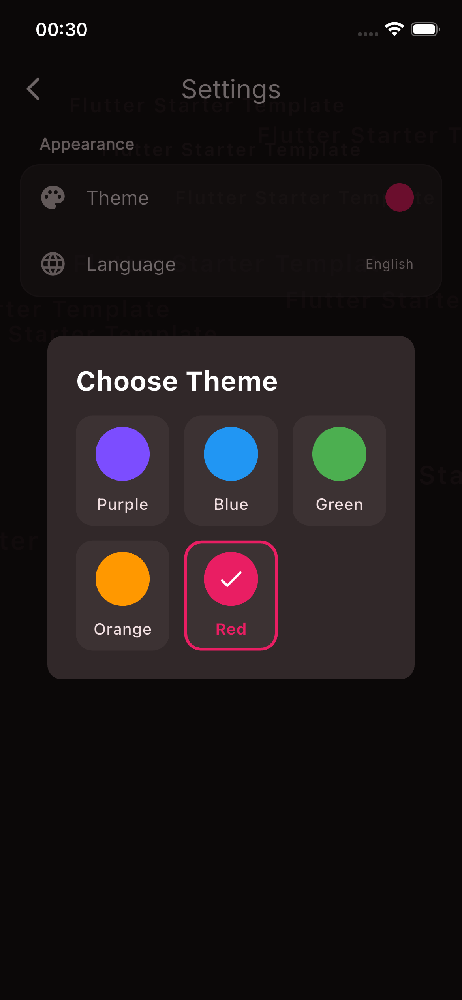

# Flutter Starter Template

A ready-to-use Flutter boilerplate that I use as the foundation for every new project. Instead of setting up architecture, theming, caching, and navigation from scratch each time, I clone this template and start building features immediately.

## What's Included

**Architecture** — Feature-based folder structure with BLoC/Cubit + Freezed for state management, GetIt for dependency injection, and GoRouter (type-safe, code-generated) for navigation.

**Theming** — Material 3 theme system with 5 color variants, light/dark mode support, and a theme selection UI. Managed via Cubit + SharedPreferences.

**Caching** — Dual-layer cache: SharedPreferences for simple key-value data, Hive CE for complex model storage. Both wrapped with clean abstractions.

**Localization** — EasyLocalization with Turkish and English out of the box. Language switching built into the settings page.

**Asset Generation** — FlutterGen for type-safe access to images, SVGs, Lottie animations, and fonts. No more hardcoded asset paths.

**Shared Widgets & Utilities** — Reusable button components (primary, secondary, text) with haptic feedback, `AppPaddings` for consistent spacing, `AppMessenger` for SnackBar/Dialog/BottomSheet via context extensions, `RegexTypes` for common validation patterns, and responsive helpers.

**Screens** — Splash, 5-step onboarding (with completion flag), home, and settings pages — all wired up and ready.

**Documentation** — The `doc/new_feature/` directory is a built-in developer guide. It contains modular docs for every common task: creating a feature folder, adding models, services, state management, views, routes, assets, caching, and more. Each file is self-contained — read only the one you need. There's also a checklist to make sure nothing is missed when adding a new feature. See [`doc/new_feature/README.md`](doc/new_feature/README.md) for the full navigation table.

## Screenshots

<p align="center">
  
  
  
  
  
</p>

## Tech Stack

| Category | Package |
|---|---|
| State Management | flutter_bloc, freezed |
| DI | get_it |
| Routing | go_router, go_router_builder |
| Cache | hive_ce, shared_preferences |
| Localization | easy_localization |
| Code Generation | build_runner, flutter_gen_runner, freezed, json_serializable |
| UI | flutter_svg, lottie, shimmer, smooth_page_indicator |

## Getting Started

```bash
# Install dependencies
flutter pub get

# Run code generation
dart run build_runner build --delete-conflicting-outputs

# Run the app
flutter run
```

## Project Structure

```
├── doc/
│   └── new_feature/          # Developer guides for adding features
│       ├── README.md          # Quick navigation + checklist
│       ├── folder_structure.md
│       ├── model_rules.md
│       ├── state_management.md
│       ├── view_rules.md
│       ├── service_rules.md
│       ├── data_storage.md
│       ├── route_and_strings.md
│       ├── widget_and_theme.md
│       ├── assets_and_flutter_gen.md
│       └── ...
├── lib/
│   ├── feature/              # Feature modules
│   │   ├── home/             # Home screen + background animation
│   │   ├── login_process/    # Splash + Onboarding flow
│   │   └── settings/         # Theme & language settings
│   └── product/              # Shared infrastructure
│       ├── cache/            # SharedCache + Hive (ProductCache)
│       ├── const/            # AppPaddings, AppString, RegexTypes
│       ├── generated/        # FlutterGen output (assets, fonts)
│       ├── init/             # App init, localization, AppBuilder
│       ├── navigation/       # GoRouter config + transitions
│       ├── service/          # Service layer
│       ├── state/            # App-wide cubits
│       ├── theme/            # Material 3 themes + ThemeCubit
│       ├── utils/            # AppMessenger, responsive, haptics
│       └── widget/           # Shared button components
└── assets/                   # Images, SVGs, Lottie, fonts, translations
```

## Credits

Some architectural patterns and utilities were referenced from [hatayi-yasat](https://github.com/Jeiji7/hatayi-yasat), a production Flutter project.

## License

Feel free to use this template for your own projects.

